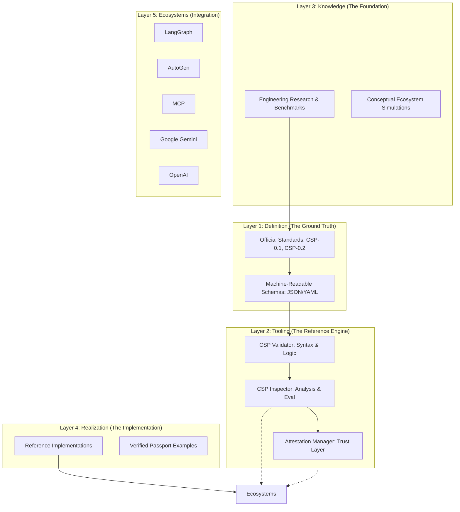

# CSP Ecosystem Architecture

This document describes the high-level architecture of the **Cognitive Skill Passport (CSP)** ecosystem and how its various components interact to enable a universal language for AI components.

## 🏗️ High-Level Architecture

The CSP ecosystem is organized into hierarchical layers, moving from abstract definitions to concrete implementations and ecosystem integrations.

## 🧱 Component Breakdown

### 1. Standards & Schemas
The core logic of the ecosystem. Standards define the human-readable intent, while Schemas provide the machine-readable enforcement.

### 2. CSP Inspector & Validator
The "Engineering Workstation". The **Validator** ensures a passport is syntactically and logically correct. The **Inspector** provides deep analysis of capabilities, metrics, and behavioral stability.

### 3. Attestation Layer
A distributed trust mechanism (Execution Attestation Layer) that allows environments to sign off on a component's behavior without modifying its immutable Passport.

### 4. Research & Simulations
The laboratory where the limits of cognitive interoperability are tested. Includes benchmarks and simulations of large-scale agent ecosystems.

### 5. AI Ecosystem Integrations
Bridges that connect CSP to existing frameworks like LangGraph, AutoGen, and the Model Context Protocol (MCP), ensuring that a CSP Passport can be understood across different runtimes.
