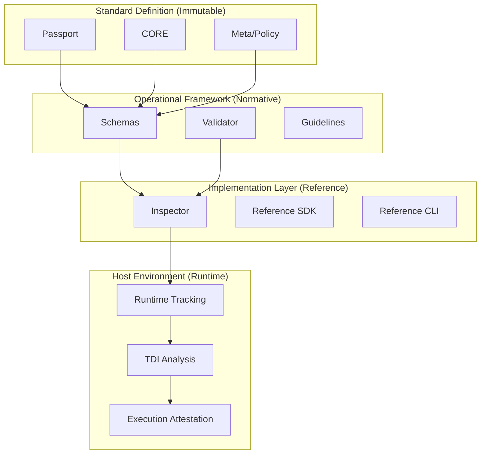

# CSP Reference Architecture Specification

**Version:** 0.1 (Draft)  
**Status:** Normative Architecture  
**Scope:** Specification of the Cognitive Skill Passport (CSP) Standard Evolution

---

## 1. Introduction
The **CSP Reference Architecture** defines the formal structure, components, and interaction patterns of the Cognitive Skill Passport standard. Unlike implementation-specific architectures, this document focuses on the *normative* requirements for any system claiming conformance with the CSP protocol.

## 2. Architectural Layers

The standard is organized into four distinct layers, ensuring separation of concerns between identity, requirements, performance, and trust.

| Layer | Name | Responsibility |
| :--- | :--- | :--- |
| **L1** | **Identity Layer** | Definition of the immutable Passport, CORE classification, and metadata. |
| **L2** | **Compatibility Layer** | Specification of I/O contracts, resource requirements, and capabilities. |
| **L3** | **Behavioral Layer** | Tracking of Runtime metrics, TDI (Divergence), and DBE (Benchmarks). |
| **L4** | **Trust Layer** | Management of Attestations, execution signatures, and reputation. |

## 3. Normative & Optional Components

### 3.1 Normative Components (Required)
- **Passport Specification:** The strict structure of the cognitive identity.
- **CORE Classifier:** The Nature.Action.Domain taxonomy.
- **Compatibility Matrix:** The mandatory description of input/output capabilities.
- **Verification Schemas:** The formal rules for syntactic correctness.

### 3.2 Optional Components
- **Runtime Performance Metadata:** Dynamic metrics (can be omitted in static contexts).
- **Execution Attestations:** Verification signatures from third-party environments.
- **Economic Value Share:** Definitions of developer/platform profit distribution (Policy layer).

## 4. Operational Pipelines

### 4.1 Validation Pipeline (Static)
The process of ensuring an artifact adheres to the CSP standard.
`Passport -> Validator (Schema Check) -> Conformance Level [L1, L2]`

### 4.2 Inspection Pipeline (Deep Analysis)
The process of evaluating the content, consistency, and potential behavior of a component.
`Conformance [L2] -> Inspector (AST/Link/Semantic Check) -> Consistency Report`

### 4.3 Trust Pipeline (Verification)
The process of issuing and verifying attestations.
`Execution -> Observation -> Attestation Manager -> Signed Proof`

## 5. Lifecycle of a Cognitive Component

1. **Definition:** Creation of the Passport (Immutable).
2. **Registration:** Validation against the standard schemas.
3. **Deployment:** Onboarding into a host environment (Compatibility check).
4. **Execution:** Generation of Runtime metrics.
5. **Evaluation:** Calculation of TDI based on deviation from Passport intent.
6. **Attestation:** Issuance of a trust-proof by the host environment.

## 6. Conformance Levels

- **Level 1 (Identity Only):** Component is defined with a valid Passport and CORE identifier.
- **Level 2 (Compatible):** Component provides detailed input/output capability contracts.
- **Level 3 (Observable):** Component supports Runtime metric tracking and TDI reporting.
- **Level 4 (Verifiable):** Component supports execution attestations and signed behaviors.

## 7. Extension Mechanism
The CSP standard is designed to be **additive**. Extensions (like CSP-0.2) must maintain backward compatibility with the core Passport structure defined in CSP-0.1. New layers (e.g., MSL - Mission Specification Layer) can be integrated as modular headers within the meta-section.

## 8. Master Architecture Diagram

---

## 9. Future Evolution
The standard anticipates a transition from a centralized reference repository to a **decentralized cognitive fabric**, where CSP Passports serve as the primary unit of exchange between heterogeneous AI runtimes (LangGraph, AutoGen, MCP, etc.) without a central authority required for identity verification.
